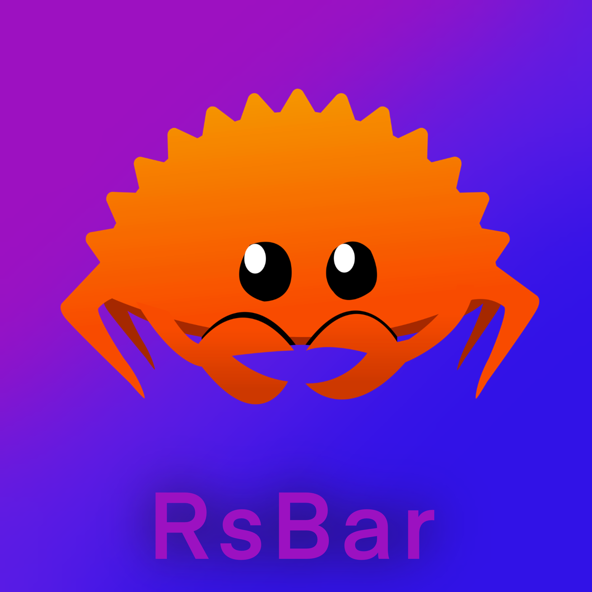

<p align="center">  </p>

<p align="center"> 
     
     
    
    
</p>

# Minimalistic status bar for hyprland 


 

## 🚩 Table of Contents


- [Description](#-description)
- [Features](#-features)
- [Available widgets](#-available-widgets)
- [Installation](#-installation-and-build)
- [Configuration](#-configuration)
- [RsBar internals](#-rsbar-internals)
- [TODO list](#-todo-list)

## 📜 Description
RsBar is a simple status bar, written in rust. It's been designed especially for hyprland and tested on the arch linux and nixos.

> [!WARNING]
> RsBar was made just for fun. We do not claim anything about its quality :)


## 🎨 Features

- Client/server architecture 📡
- Speed and overall performance due to the rust language and tokio runtime 🚀
- Gtk themes support 🖥
- Minimalistic design and interface 👁

## 💿 Available widgets

- Hyprland workspaces (`hyprland` required)
- Volume (`wpctl` required)
- Brightness (`brightnessctl` required)
- Time
- **More widgets are being developed right now...**

## 🌏 Installation and build

The nixos flake and AUR package are currently in development. For now the only way to install RsBar is to build it from source:

```bash
cargo build --bin rsbar --bin rsbar-daemon --profile release
```

RsBar requires these dependencies to be installed in your system:
- pkg-config
- cairo
- glib
- gtk4
- gtk4-layer-shell
- graphene

> [!IMPORTANT]
> **rsbar-daemon** (server) binary must be launched before **rsbar** (client). The best option for that is a **systemd service** or an **exec-once** option in hyprland config

## 🔧 Configuration

### Rotation and position `WIP`

Rsbar (and each widget) rotation and position are specified in the code and could not be changed without consequences. 

### Widgets `WIP`
RsBar user interface consists of various widgets (volume, brightness, time, etc...). Each widget has its own position in the top, middle or bottom box. Widget configuration parameters are established in the source code (`main.rs`) manually.  

### Styles
Style configuration is declared in `$HOME/.config/rsbar/style.css` file with css. Each widget element has it's own css class. For example time widget has class `time-widget`. A list of all classes in current version is presented below:

| class | configures |
--------|----------
`main-window` | RsBar window
`time-widget` | Time widget
`brightness-widget` | Brightness widget (belongs to each element in the brightness widget)
`brightness-widget-slider` | Brightness widget's slider
`brightness-widget-container` | Brightness widget's container (contains slider and icon)
`brightness-widget-label` | Brightness's widget button
`volume-widget` | Volume widget (belongs to each element in the volume widget)
`volume-widget-slider` | Volume widget's slider
`volume-widget-container` | Volume widget's container (contains slider and button)
`volume-widget-label` | Volume widget's button
`hyprland-workspaces-widget` | Hyprland workspaces widget (belongs to each element in the hyprland workspaces widget)
`hyprland-workspaces-widget-container` | Hyprland workspaces widget container (contains all buttons)
`hyprland-workspaces-widget-button` | Hyprland workspaces widget's button

## 💡 RsBar internals

RsBar uses client/server model to collect system info and show it in widgets. This approach significantly decreases I/O load and allows user interface to be more customizable. Here's an approximate graph of how it works:


Contexts are responsible for communicating with the system services (like hyprland and backlight driver). Data collected by contexts are then being sent to a clients by the RsBar server core. 

### IPC

Rsbar server and client use UNIX sockets to exchange data. Server is responsible for creating sockets and listening for the new clients. 

- Each client should subscript to a needed events by sending an event name to the event socket. Event names are created in the following format: `<context name>/<event name>`. For example, time event is named `time/time`. After subscribing, server automaticly sends events to each subscribed client. Events are being sent in such format: `<context name>/<event name>/<params>` 
- Actions are performed by sending calls to the call socket. Call format is `<context name>/<procedure name>/<params>`. Sometimes calling a procedure could trigger a couple of corresponding events. For example, making a `volume/setVolume/0.4` call, triggers a `volume/volume/0.4` event as a feedback.

> [!IMPORTANT]
> All events are being sended as a broadcast. So it's impossible to send an event to some specific client.

> [!IMPORTANT]
> The last `/` symbol is obligatory even if `<params>` value is blank

Here're the tables with all of the contexts and their events and procedures:

| context name | event name | params |
----------|-------|--------|
time | time | string with the current system time value in format `HH\nMM`
volume | volume | volume value (integer in range `0` - `100`)
volume | isMuted | `true` if volume is muted and `false` if not
brightness | brightness | brightness value (integer in range `0` - `100`)
hyprland | workspace | current workspace number (`-1` in case of error)

| context name | procedure name | params |
-|-|-|
volume | setVolume | volume value (from `0.0` to `1.0`)
volume | toggleMute | nothing
brightness | setBrightness | brightness value (from `0.0` to `1.0`)
hyprland | setWorkspace | new workspace number

### Adding your own widget `WIP`

Each new widget has to implement a `BarWidget` trait

### Adding your own data context `WIP`
Each new widget has to implement an `RsbarContext` trait

## ✅ TODO list

- ~~Client/server architecture~~ ✅
- AUR and nixos packages
- Configuration file
- Orientation customization via config file
- Battery widget
- Tray icons widget
